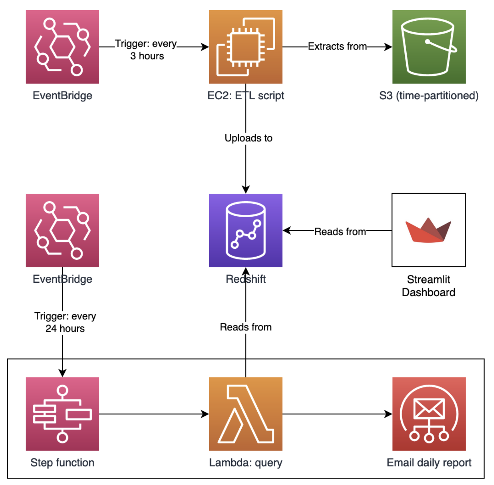

# 🚚 T3-Pipeline
A complex, fully-automated, cloud-based pipeline to help a fictional food truck company (T3) work out which of their trucks are most profitable.

## 📝 About
_Tasty Truck Treats_ (T3) is a catering company that specializes in operating a fleet of food trucks in Lichfield and its surrounding areas. While each food truck operates independently on a day-to-day basis, T3 collects overall sales data from each truck at the end of every month, giving an overall view of how their fleet is performing.

Collecting monthly sales data from each truck isn't giving T3 enough detail to really be a data-informed organisation. T3 would like to have an automated pipeline that regularly collects transaction-level data from every truck for central analysis. This data will allow the company to evaluate the performance of each truck, track trends, identify popular items, and make informed decisions about menu adjustments, marketing strategies, and overall fleet management.

Ideally, the end result of this pipeline would include
- A live, accessible dashboard for non-technical T3 employees
- Regularly-generated summary reports

This project aims to achieve this, and serves as a chance for me to get experience setting up and scheduling cloud resources, as well as learning a new dashboarding framework (Streamlit) and a new dialect of SQL (Redshift).

## 🛠️ Architecture

## ⚙️ Setup
Follow the instructions provided in the `README.md` files located in each folder.

## 🗂️ Repository Contents
- `dashboard` - contains all the code and resources required to run the dashboard
- `pipeline` - contains all the code and resources required to run the pipeline
- `report` - contains all the code and resources required to generate the summary reports as an AWS Lambda Function
- `terraform` - contains all the terraform code required to build the AWS ECS Service to run the dashboard
